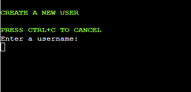
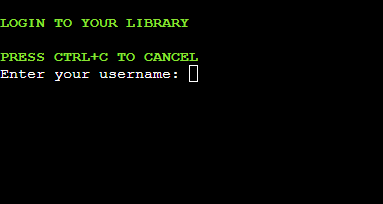
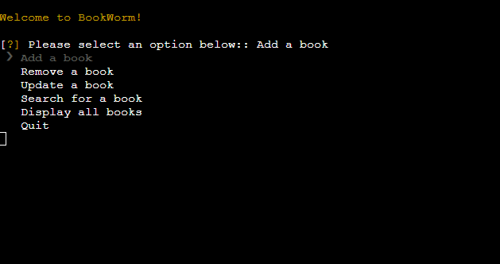
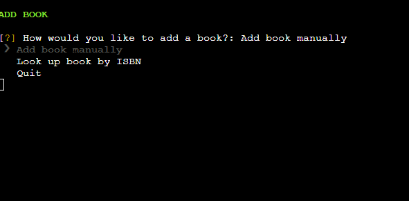
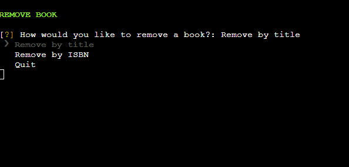
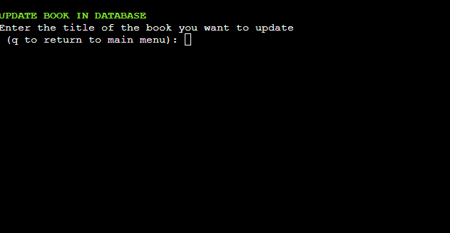
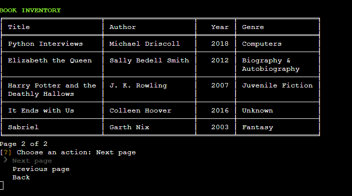
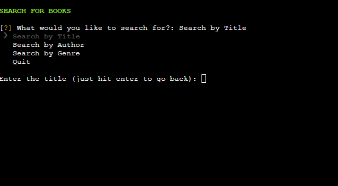
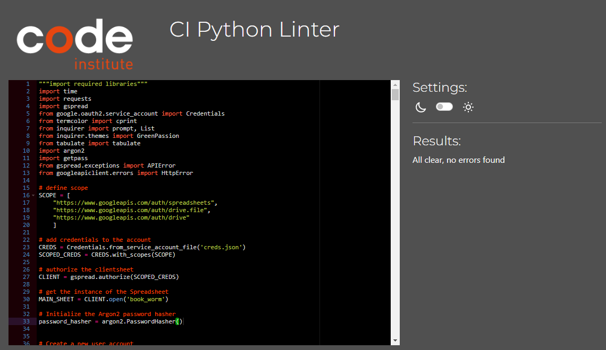

# BOOK-WORM

## Table of contents

- [BOOK-WORM](#book-worm)
  - [Table of contents](#table-of-contents)
  - [Introduction](#introduction)
  - [UI Decisions](#ui-decisions)
  - [Features](#features)
    - [Create a new user](#create-a-new-user)
    - [Login as a user](#login-as-a-user)
    - [Main menu function](#main-menu-function)
    - [Add a book](#add-a-book)
    - [Remove a book](#remove-a-book)
    - [Update a book](#update-a-book)
    - [Display books](#display-books)
    - [Search for books](#search-for-books)
  - [Features left to implement](#features-left-to-implement)
  - [Technology Used](#technology-used)
    - [Python](#python)
      - [Libraries](#libraries)
    - [Google Sheets API](#google-sheets-api)
  - [Testing](#testing)
    - [Python Linting](#python-linting)
    - [Manual Feature Testing](#manual-feature-testing)
  - [Bugs](#bugs)
  - [Deployment](#deployment)
    - [Cloning and Forking](#cloning-and-forking)
    - [Local Deployment](#local-deployment)
    - [Remote Deployment](#remote-deployment)
  - [Credits and Acknowledgements](#credits-and-acknowledgements)

[Table of contents generated with markdown-toc]('http://ecotrust-canada.github.io/markdown-toc/')

## Introduction

BookWorm is a Python based command line book inventory application that uses Google Sheets as a database. It allows users to add, remove, update, search for and display books from the inventory. The code uses the gspread library to interact with Google Sheets and the Google Drive API to authorize access to the sheets. The main menu displays library management options to the user, and the other functions handle specific tasks such as adding, removing, updating, or displaying books. The code also includes error handling and input validation to ensure that the data entered is valid. There is a user system with secure password storage which creates an individual library for each user automatically on account creation.

## UI Decisions

The UI of this application is a command line interface. The main menu function displays the options to the user, and the user can enter their choice by navigating menus with the arrow keys (thanks to the PyInquirer library) where possible. The various functions handle specific tasks such as adding, removing, updating, or displaying books. The display_books function displays the books in pages of 6 with navigation controls that allow the user to move between pages in order to avoid the need for vertical scrolling where possible. The same reasoning was used in displaying search results.

## Features

This section explains each part of the project and the value it brings to acheiving the project goal.

### Create a new user

The create_user function allows the user to create a new account with a unique username and password, and also creates a new sheet in Google Sheets for the user. The user's information is stored in the 'users' sheet, including their username and hashed password. The function uses the Argon2 password hashing algorithm to securely hash the user's password. If a sheet with the same username already exists, the function displays an error message and the account creation process is cancelled. If successful, the function prints a success message and returns.

### Login as a user

The login function allows users to log in to their existing account by verifying their username and password. It provides security by using password hashing to protect user information, as well as preventing the console from echoing the password input to hide from view using the getpass library. If the login is successful, the function sets the user's sheet as the global SHEET variable in the 'book_worm' spreadsheet, allowing users to access their personal library of books. If there are any errors during the login process, the function returns False and displays an error message to the user. The user can cancel the login process at any time by pressing Ctrl+C.

### Main menu function

After logging in, the main_menu function displays a menu of options to the user for different library functions and returns their choice. The menu is displayed using the PyInquirer library, which presents the user with a list of options to choose from. The options available to the user are:

- Add a book
- Remove a book
- Update a book
- Search for a book
- Display all books
- Quit

### Add a book

The add_book_menu displays a menu to the user that prompts them to choose how they would like to add a book to the library. The function uses the prompt() function from the PyInquirer library to display a list of options, including adding a book manually, looking up a book by its ISBN, or quitting. The function then reads the user's choice and calls the appropriate function (add_book or add_book_isbn) or quits the menu if the user chooses to do so.

Add_book prompts the user to input the book details such as title, author, year (optional), and genre. It validates the input and adds the book to the sheet. It then prompts the user if they want to add another book. The user can exit this function at any time prior to adding the new book by pressing CTRL+C.

Add_book_isbn prompts the user to input an ISBN and looks up the book details using the Google Books API. If the book is found, it extracts the title, author(s), year, and genre from the API response and adds them to the sheet. It then prompts the user if they want to add another book. If the book is not found or an invalid ISBN is entered, it informs the user and prompts them to try again. The user can exit the process by entering 'q' instead of a number.

### Remove a book

The remove_book_menu displays a menu to the user that prompts them to choose how they would like to remove a book from the library. The function uses the prompt() function from the PyInquirer library to display a list of options, including removing a book by title, removing a book by its ISBN, or quitting. The function then reads the user's choice and calls the appropriate function (remove_book or remove_book_isbn) or quits the menu if the user chooses to do so.

The remove_book function prompts the user to input the title of the book they want to remove. It then finds the book in the sheet and removes it. It prompts the user if they want to remove another book. If the book is not found, it informs the user and prompts them to try again.

The remove_book_isbn function prompts the user to input an ISBN and looks up the book details using the Google Books API. If the book is found, it extracts the title from the API response and searches for it in the sheet. If the book is found, it removes it and prompts the user if they want to remove another book. If the book is not found or an invalid ISBN is entered, it informs the user and prompts them to try again.

### Update a book

The update_book() function is a feature that allows the user to update an existing book in the database. The function prompts the user to enter the title of the book they want to update and then searches for the book in the database. If the book is found, the function prompts the user to enter the new values for the book's fields (title, author, year, and genre), and then updates the corresponding cells in the spreadsheet. The user can choose to keep the existing values for any field by pressing Enter. If the user enters an invalid value, the function displays an appropriate error message and prompts the user to enter a valid value. Once the book has been successfully updated, the function returns to the main menu.

### Display books

The display_books function is responsible for displaying the books in the database with 6 books per page and navigation controls. It retrieves all the records from the sheet, formats the data using the tabulate library, and displays the records in pages of 6. The user can navigate through the pages using the provided navigation controls such as "Next page", "Previous page", and "Back". The updated function (previously 10 books per page) improves the user experience by displaying fewer books per page, making it easier for users to navigate through the book inventory without having to scroll.

### Search for books

The search books feature allows the user to search for books in the database by title, author or genre. It includes three functions: search_books_by_title(), search_books_by_author() and search_books_by_genre(), each of which searches for books by the respective parameter. If matching books are found, the display_search() function is called to display the search results. The search_menu() function displays a menu of search options and returns the user's choice, while search_choice() handles the user's search choice and continues the search until the user chooses to quit.

## Features left to implement

I'm happy with the scope that was acheived in the timescale I had, however in the future I would have like to give the user the ability to navigate the database directly via the arrow keys and select the option to remove or update books directly. This would avoid any mistyping of titles being an issue for the user.
This could also be implemented as part of search results.

There could also be scope to add further attributes to books such as ratings or reading status.

## Technology Used

### Python

#### Libraries

- requests is used for making HTTP requests to the Google Sheets API.
- gspread is used as a Python API for interacting with Google Sheets.
- google-auth is used for authenticating with Google APIs.
- termcolor is used for adding colored output to the console.
- inquirer is used for creating interactive command-line prompts.
- tabulate is used for formatting data into tables.
- argon2 is used for password hashing.
- gspread.exceptions.APIError is an exception raised by gspread when there is an error with the Google Sheets API.
- googleapiclient.errors.HttpError is an exception raised by the Google API client when there is an HTTP error.

### Google Sheets API

The Google Sheets API is used in this project to interact with a Google Sheet (book-worm) that serves as the library database. The program uses the gspread library to access the sheet and retrieve data such as the book titles and their corresponding details. The API also enables the program to update the database with new books or changes to existing ones. The API key and credentials are stored securely in JSON format, which is used by the program to authenticate the API requests.

### Other technologies used

- Gitpod
- Github
- Heroku
- CI Mock termnial (CSS HTML JS)

## Testing

### Python Linting

All code passed through PEP8 linter with no errors

### Manual Feature Testing

All manual test cases can be found in [TESTING.md](./TESTING.md)

## Bugs

No known bugs remaining

## Deployment

This section describes the process of obtaining a copy of this websites files in a new repository, running an environment to work on the site, and deploying to a live platform

### Cloning and Forking

- At the top of the repository page, select fork and choose a name for the new repository to create a copy

- Alternatively select code above the file viewer and either use the link to pull a copy of the code or download the code as a zip file

### Local Deployment

- Navigate to [Gitpod](https://gitpod.io/)

- Login using a Github account

- Download and install the Gitpod browser extension

- Return to the repository

- Select the green Gitpod button above the file viewer

### Remote Deployment

To deploy the program on Heroku and ensure that all features work as expected, follow these steps:

- Fork the repository of the program.

- Create a new app in Heroku by selecting "Create new app" from the "New" menu at the top right.

- Follow the instructions provided by Heroku, and select "Reveal Config Vars" in the "Config Vars" section.

- In the field for KEY type CREDS and in the field for VALUE add the content from your credentials json file. Then click add.

  - To generate the creds.json file;
    - Go to the Google Cloud Console.
    - Create a new project or select an existing one.
    - Enable the Google Sheets API in the project.
    - Go to the "Credentials" page and click "Create credentials", then select "Service account key".
    - Select "New service account", give it a name, and select "JSON" as the key type.
    - Click "Create" to download the JSON file with the credentials.
    - Move the downloaded JSON file to the root directory of your project and rename it to creds.json.

- In the config vars, also enter "PORT" for the second key and "8000" for the value.

- Scroll down to the "Buildpacks" section, and select "Add". Add the "Python" buildpack.

- Select "Add" again, and add the "NodeJS" buildpack. This must be added after the Python buildpack.

- From the top menu, select "Deploy", and then select "GitHub".

- Confirm that you want to deploy using GitHub, and you may be asked to enter your GitHub password.

- In the "Connect to GitHub" section, use the search box to find the repository with the program.

- Connect to the repository and deploy it. The site will be deployed shortly, and you will be given a link to the deployed site when the process is complete.

The live link can be found [here](https://bwnc-book-worm.herokuapp.com/)

## Credits and Acknowledgements

The ASII book on the title page was found [here](https://ascii.co.uk/art/books)

The ASCII text (BookWorm) was created using [this](https://patorjk.com/software/taag/#p=display&h=3&f=Doom&t=BookWorm) site

Thanks to my mentor Chris Quinn for his guidance and advice
